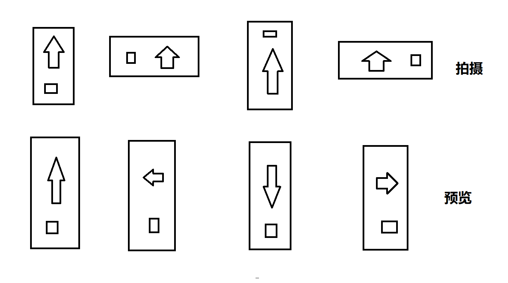

## 项目中要导入 exif-js
- 可以直接用文件中的exif-js-master
- 也可以<script src="https://cdn.jsdelivr.net/npm/exif-js"></script>

## 函数和参数
```
let Options = {
    removeBase64Header: false,//是否移除 base64前缀
    maxSize: 200 * 1024,//最大尺寸
    sizeRate:1,//按比例缩放尺寸
    fillBgColor: '#ffffff',//背景色
};
```
```
imageListConvert(files, callback, options) 
```
详情见压缩测试.html


效果

